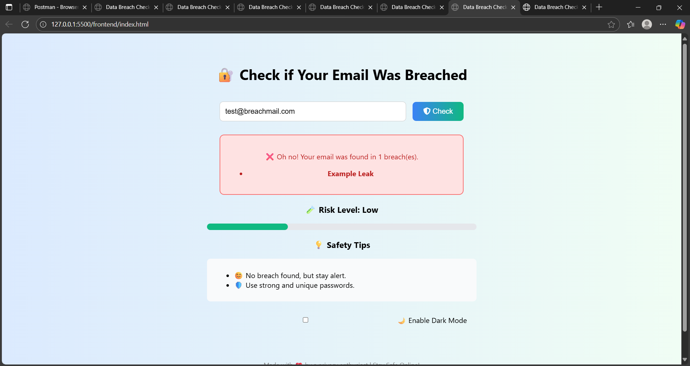
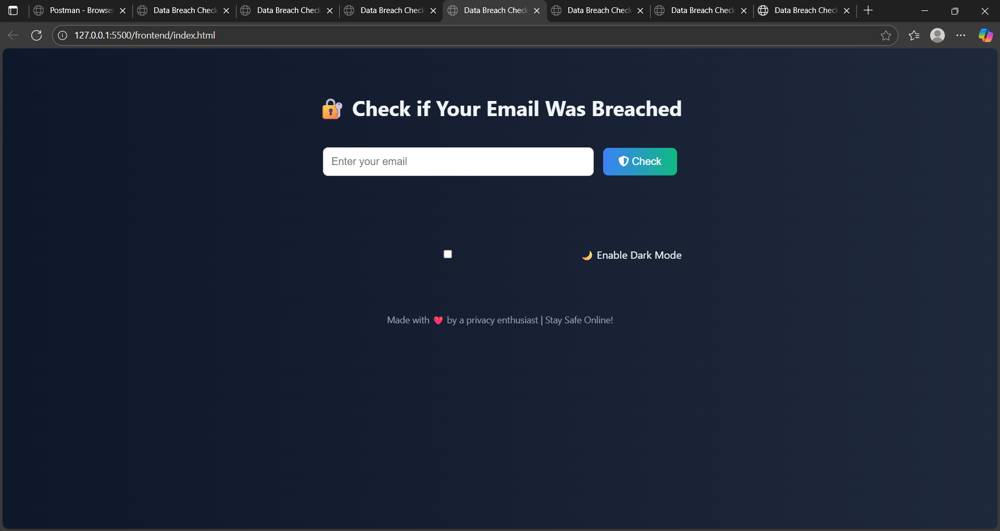

# 🔐 MailXposed – Check if Your Email Was Breached

MailXposed is a full-stack web app that checks if your email address has been exposed in known data breaches.

## 🌐 Live Demo
(Will be added after deployment)

## 🚀 Features

- 📧 Check email for data breach history
- 🌗 Toggle between Light and Dark Mode
- 📊 Risk Meter with safety tips
- ✅ Real-time feedback with clear results
- 🔒 Built with Node.js + Express + HTML/CSS/JS

## 📸 Screenshots

### 💡 Light Mode


### 🌗 Dark Mode


## 📁 Project Structure

MailXposed/
├── public/
├── routes/
├── index.js
├── db.js
├── .env
└── README.me

## 🛠️ Tech Stack

- Frontend: HTML, CSS, JavaScript
- Backend: Node.js, Express
- Database: JSON-based data
- Deployment: Render (to be added)

## 🧠 How It Works

1. User enters an email
2. Domain is extracted (e.g., `gmail.com`)
3. App checks for matching breached records in database
4. Shows risk level and breach details

## 📥 Installation

```bash
git clone https://github.com/Vaishnaviiii-23/MailXposed.git
cd MailXposed
npm install
node index.js
Then open public/index.html in your browser.

🧑‍💻 Author
Vaishnavi P Poojari


